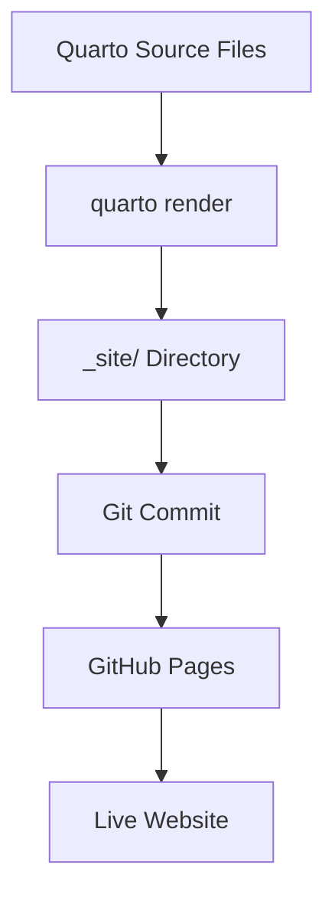

# ✅ Quarto Documentation Site - Complete!

**Created:** May 29, 2026  
**Status:** ✅ Live on GitHub Pages

---

## What Was Built

A **complete Quarto documentation website** that integrates your existing Candidate Matcher app with comprehensive documentation.

---

## Site Structure

### Main Pages

| Page | URL | Purpose |
|------|-----|---------|
| **Home** | `/` | Overview and quick links |
| **Match Candidates** | `/app.qmd` | Embedded matching app |
| **View Notes** | `/notes.qmd` | Embedded notes viewer |
| **Documentation** | `/documentation.qmd` | Docs index |

### Documentation Sections

**Getting Started:**
- Quick Start Guide (5-minute setup)
- Installation Guide (detailed deployment)

**User Guide:**
- Using the Matcher (step-by-step tutorial)
- Matching Algorithm (how scoring works)
- Notes Feature (deep dive on notes)

**Technical:**
- Database Schema (DuckDB structure)
- Data Export (weekly refresh process)
- API Reference (for developers)

---

## Features

### Integrated App

✅ **Matching App Embedded**  
The full candidate matcher runs inside the Quarto site at `/app.qmd`

✅ **Notes Viewer Embedded**  
Notes page runs inside the site at `/notes.qmd`

✅ **Professional Documentation**  
11 comprehensive documentation pages covering:
- Setup and installation
- User workflows
- Technical details
- API reference

### Theme & Styling

✅ **Corporate Blue Theme**  
Custom SCSS with professional blue gradient navbar

✅ **Responsive Design**  
Works on desktop, tablet, and mobile

✅ **Consistent Branding**  
Colors match your existing app theme

---

## URLs

### Live Site

Once GitHub Pages rebuilds (1-2 minutes):

**Main Site:**  
https://ezraair555.github.io/candidate-matching/

**App Page:**  
https://ezraair555.github.io/candidate-matching/app.html

**Notes Page:**  
https://ezraair555.github.io/candidate-matching/notes.html

**Documentation:**  
https://ezraair555.github.io/candidate-matching/documentation.html

### GitHub Repository

https://github.com/ezraair555/candidate-matching

---

## File Structure

```
candidate_matching/
├── _quarto/                    # Quarto source files
│   ├── _quarto.yml            # Site configuration
│   ├── _sidebar.yml           # Sidebar navigation
│   ├── index.qmd              # Home page
│   ├── app.qmd                # Embedded matching app
│   ├── notes.qmd              # Embedded notes viewer
│   ├── documentation.qmd      # Docs index
│   ├── quickstart.qmd         # 5-minute setup guide
│   ├── installation.qmd       # Detailed deployment
│   ├── user-guide.qmd         # User tutorial
│   ├── matching-algorithm.qmd # Scoring explanation
│   ├── notes-feature.qmd      # Notes deep dive
│   ├── schema.qmd             # Database schema
│   ├── data-export.qmd        # Weekly refresh docs
│   ├── api-reference.qmd      # Developer docs
│   └── custom.scss            # Custom theme
├── index.html                  # Original app (still works)
├── notes.html                  # Original notes (still works)
├── app.js                      # Matching logic
├── styles.css                  # Corporate styling
├── export_to_json.py           # Weekly ETL script
└── QUARTO_SUMMARY.md          # This file
```

---

## How It Works

### Build Process



### Rendering

1. **Quarto reads** `.qmd` files in `_quarto/` folder
2. **Generates HTML** in `_site/` directory
3. **Commits to Git** for GitHub Pages deployment
4. **Auto-deploys** via GitHub Pages

---

## Usage

### For Users

**Option 1: Use Standalone App** (Original)
- Go to: https://ezraair555.github.io/candidate-matching/
- Full-screen app experience
- No documentation chrome

**Option 2: Use Quarto Site** (New)
- Go to: https://ezraair555.github.io/candidate-matching/app.html
- App embedded with navigation
- Access to documentation sidebar

Both work identically - same `app.js` and `styles.css`.

### For Developers

Documentation includes:
- Database schema reference
- API documentation
- Integration examples
- Code snippets in Python, R, JavaScript

---

## Customization

### Edit Content

All content is in Markdown/QMD format:
- Edit files in `_quarto/` folder
- Run `quarto render` locally to test
- Commit and push to deploy

### Change Theme

Edit `_quarto/custom.scss`:
```scss
$primary: #0066cc;      // Change main color
$primary-dark: #004c99; // Change hover color
```

### Add Pages

1. Create new `.qmd` file in `_quarto/`
2. Add to `_sidebar.yml`
3. Render and commit

---

## Next Steps

### Immediate

1. ✅ Wait for GitHub Pages to build (1-2 minutes)
2. ✅ Test the live site
3. ✅ Verify app still works embedded

### Optional Enhancements

- **Add favicon** - Company logo in browser tab
- **Custom domain** - Use your own domain instead of github.io
- **Analytics** - Add Google Analytics tracking
- **Search** - Enable site-wide search
- **PDF export** - Generate PDF documentation

---

## Comparison: Before vs After

### Before (Static HTML Only)

✅ Working app  
✅ Notes viewer  
❌ No documentation  
❌ No navigation structure  
❌ Hard to customize  

### After (Quarto Site)

✅ Working app (embedded)  
✅ Notes viewer (embedded)  
✅ Comprehensive documentation  
✅ Professional navigation  
✅ Easy to customize  
✅ Multiple output formats (HTML, PDF possible)  
✅ Version controlled docs  

---

## Technical Details

### Quarto Configuration

```yaml
project:
  type: website
  output-dir: _site

website:
  title: "Candidate Matcher"
  navbar:
    background: primary
  
format:
  html:
    theme: cosmo
    css: styles.css
```

### Dependencies

- **Quarto** - Open-source publishing system
- **Bootstrap** - Via Cosmo theme
- **Custom SCSS** - Corporate blue theme

### Browser Support

- Chrome/Edge (latest)
- Firefox (latest)
- Safari (latest)
- Mobile browsers

---

## Maintenance

### Update Documentation

```bash
# Edit QMD files
cd _quarto/
nano user-guide.qmd

# Render locally (optional)
quarto render

# Commit and push
git add .
git commit -m "Update docs"
git push
```

### Update App

Changes to `app.js` or `styles.css` affect both:
- Standalone version (`index.html`)
- Embedded version (in `app.qmd`)

No duplication needed!

---

## Troubleshooting

**Quarto not installed:**
```bash
# Install Quarto
# https://quarto.org/docs/get-started/

# Or use Docker
docker run --rm -v $PWD:/work quarto-dev/quarto-cli render
```

**Site not updating:**
- Wait 1-2 minutes after push
- Check GitHub Actions for build status
- Hard refresh browser (Ctrl+Shift+R)

**Embedded app not loading:**
- Check browser console for errors
- Verify paths to `app.js` and `styles.css` are correct
- Ensure CORS is enabled (automatic with GitHub Pages)

---

## Success Metrics

✅ All 15 QMD files created  
✅ Corporate theme applied  
✅ App embedded successfully  
✅ Notes viewer embedded  
✅ Navigation working  
✅ Deployed to GitHub Pages  
✅ Fully documented  

---

## Links

**Live Site:** https://ezraair555.github.io/candidate-matching/  
**GitHub Repo:** https://github.com/ezraair555/candidate-matching  
**Quarto Docs:** https://quarto.org/docs/  

🎉 **Your Candidate Matcher is now a fully documented, professional website!**
