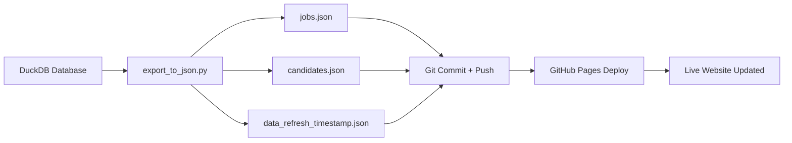

## Weekly Data Refresh Process

Automated export from DuckDB to GitHub Pages.

---

## Overview

The data export process:



**Frequency:** Weekly (recommended)  
**Duration:** 1-2 minutes  
**Automation:** Cron job

---

## Manual Export

### One-Time Export

```bash
cd /path/to/candidate-matching

python3 export_to_json.py \
    --duckdb-path /path/to/your/database.db \
    --github-repo .
```

**Expected output:**
```
📊 Connecting to DuckDB: /path/to/database.db
Found tables: ['jobs', 'candidates']
✓ Exported 20 records from jobs → jobs.json
✓ Exported 50 records from candidates → candidates.json

✅ Export complete! Data refreshed at 2026-05-29T12:00:00Z

Next steps:
  1. git add *.json data_refresh_timestamp.json
  2. git commit -m 'Weekly data refresh: 2026-05-29'
  3. git push origin main
```

### Commit and Push

```bash
git add jobs.json candidates.json data_refresh_timestamp.json
git commit -m "Weekly data refresh: $(date +%Y-%m-%d)"
git push origin main
```

GitHub Pages will auto-deploy within 1-2 minutes.

---

## Automated Export (Cron Job)

### Setup Cron

```bash
crontab -e
```

Add this line (runs every Monday at 6 AM):

```bash
0 6 * * 1 cd /home/lucas/.openclaw/workspace/candidate_matching && \
    python3 export_to_json.py \
        --duckdb-path /path/to/your/sigma_analytics.db \
        --github-repo . && \
    git add jobs.json candidates.json data_refresh_timestamp.json && \
    git commit -m "Weekly data refresh: $(date +\%Y-\%m-\%d)" && \
    git push origin main >> /tmp/candidate_cron.log 2>&1
```

### Cron Schedule Options

| Schedule | Cron Expression | Description |
|----------|----------------|-------------|
| **Weekly (Mon 6 AM)** | `0 6 * * 1` | Recommended ✅ |
| Weekly (Sun 11 PM) | `0 23 * * 0` | End of week |
| Bi-weekly | `0 6 */14 * *` | Every 2 weeks |
| Monthly (1st) | `0 6 1 * *` | First of month |
| Daily (9 AM) | `0 9 * * *` | Daily updates |

### Test Cron Job

```bash
# Run manually first to test
/path/to/export_to_json.py --duckdb-path /path/to/db.db --github-repo .

# Check if cron is running
sudo systemctl status cron

# View cron logs
grep CRON /var/log/syslog | tail -20

# Check your cron jobs
crontab -l
```

### Troubleshooting Cron

**Job not running:**
```bash
# Check cron daemon
sudo service cron status

# Restart if needed
sudo service cron restart
```

**Git push failing:**
```bash
# Test git credentials
cd /path/to/repo && git push

# If auth issues, configure credential helper
git config --global credential.helper store
```

**Python not found:**
```bash
# Find python3 path
which python3

# Use full path in cron
/usr/bin/python3 /path/to/export_to_json.py ...
```

---

## Export Script Options

### Command Line Arguments

```bash
python3 export_to_json.py \
    --duckdb-path PATH \      # Required: Path to DuckDB file
    --github-repo PATH \      # Required: Path to repo root
    --limit N                 # Optional: Limit records (testing)
```

### Examples

**Test with limited records:**
```bash
python3 export_to_json.py \
    --duckdb-path sample.db \
    --github-repo . \
    --limit 5
```

**Production export:**
```bash
python3 export_to_json.py \
    --duckdb-path /data/sigma_analytics.db \
    --github-repo /home/lucas/.openclaw/workspace/candidate_matching
```

---

## Output Files

### jobs.json

Array of job objects:
```json
[
  {
    "job_id": 1,
    "title": "Senior Software Engineer",
    "company": "TechCorp",
    "location": "Remote",
    "employment_type": "full-time",
    "experience_level": "senior",
    "salary_min": 140000,
    "salary_max": 180000,
    "required_skills": ["Python", "AWS", "Docker"],
    "preferred_skills": ["Kubernetes", "React"],
    "status": "active",
    "posted_date": "2026-05-01",
    ...
  }
]
```

### candidates.json

Array of candidate objects:
```json
[
  {
    "candidate_id": 1,
    "first_name": "Jane",
    "last_name": "Doe",
    "email": "jane@email.com",
    "current_title": "Senior Developer",
    "current_company": "StartupXYZ",
    "years_experience": 8,
    "experience_level": "senior",
    "skills": ["Python", "AWS", "Docker", "React"],
    "availability": "2-weeks",
    "salary_expectation_min": 150000,
    "salary_expectation_max": 170000,
    ...
  }
]
```

### data_refresh_timestamp.json

Metadata about last refresh:
```json
{
  "last_refresh": "2026-05-29T12:00:00.000Z",
  "timezone": "UTC",
  "source_db": "/path/to/database.db",
  "tables_exported": ["jobs", "candidates"]
}
```

Displayed in app header to show data freshness.

---

## Data Validation

### Pre-Export Checks

Before exporting, verify:

```sql
-- Check jobs count
SELECT COUNT(*) FROM jobs WHERE status = 'active';

-- Check candidates count  
SELECT COUNT(*) FROM candidates WHERE status = 'active';

-- Verify skills are populated
SELECT job_id, required_skills 
FROM jobs 
WHERE required_skills IS NULL OR array_length(required_skills) = 0;

-- Check for duplicate IDs
SELECT job_id, COUNT(*) 
FROM jobs 
GROUP BY job_id 
HAVING COUNT(*) > 1;
```

### Post-Export Validation

```bash
# Check file sizes (should be >1KB if data exists)
ls -lh *.json

# Validate JSON syntax
python3 -m json.tool jobs.json > /dev/null && echo "jobs.json: OK"
python3 -m json.tool candidates.json > /dev/null && echo "candidates.json: OK"

# Count records
python3 -c "import json; print('Jobs:', len(json.load(open('jobs.json'))))"
python3 -c "import json; print('Candidates:', len(json.load(open('candidates.json'))))"
```

---

## GitHub Actions Alternative

Instead of cron, use GitHub Actions for automated exports:

### Workflow File

Create `.github/workflows/refresh-data.yml`:

```yaml
name: Weekly Data Refresh

on:
  schedule:
    - cron: '0 6 * * 1'  # Every Monday at 6 AM
  workflow_dispatch:  # Allow manual trigger

jobs:
  refresh:
    runs-on: ubuntu-latest
    
    steps:
      - uses: actions/checkout@v3
      
      - name: Set up Python
        uses: actions/setup-python@v4
        with:
          python-version: '3.10'
      
      - name: Install dependencies
        run: pip install duckdb pandas
      
      - name: Export data
        env:
          DUCKDB_PATH: ${{ secrets.DUCKDB_PATH }}
        run: |
          python3 export_to_json.py \
            --duckdb-path $DUCKDB_PATH \
            --github-repo .
      
      - name: Commit and push
        run: |
          git config user.name "GitHub Actions"
          git config user.email "actions@github.com"
          git add *.json data_refresh_timestamp.json
          git commit -m "Automated data refresh: $(date +%Y-%m-%d)"
          git push
```

### Advantages

✅ Runs in cloud (no local server needed)  
✅ Version controlled workflow  
✅ Email notifications on failure  
✅ Manual trigger option  
✅ No cron setup required  

### Disadvantages

❌ Can't access local DuckDB directly  
❌ Need to upload database or use cloud DB  
❌ Requires GitHub Actions setup  

---

## Best Practices

### Timing

- **Export during off-hours** - Early morning or late night
- **Consistent schedule** - Same day/time each week
- **Allow deployment time** - 1-2 minutes before users arrive

### Monitoring

```bash
# Check last export timestamp
cat data_refresh_timestamp.json | grep last_refresh

# Verify GitHub Pages deployed
curl -I https://YOUR_USERNAME.github.io/candidate-matching/

# Check cron logs
tail -f /tmp/candidate_cron.log
```

### Backup

Before each export:
```bash
# Backup previous JSON files
cp jobs.json backup/jobs_$(date +%Y-%m-%d).json
cp candidates.json backup/candidates_$(date +%Y-%m-%d).json
```

### Rollback

If bad data is exported:
```bash
# Revert last commit
git revert HEAD

# Or reset to previous commit
git log --oneline  # Find good commit
git reset --hard <commit-hash>
git push --force
```

---

## Troubleshooting

**Export script fails:**
```bash
# Check Python dependencies
pip install --upgrade duckdb pandas

# Verify database path exists
ls -la /path/to/database.db

# Test database connection
duckdb /path/to/database.db "SELECT COUNT(*) FROM jobs;"
```

**JSON files empty:**
```sql
-- Check if tables have data
SELECT COUNT(*) FROM jobs;
SELECT COUNT(*) FROM candidates;

-- Verify table names match
SHOW TABLES;
```

**Git push fails:**
```bash
# Check authentication
git remote -v
git config --global credential.helper

# Try manual push
git push origin main

# If using SSH, check keys
ssh-add -l
ssh-keygen -t ed25519 -C "your_email@example.com"
```

**GitHub Pages not updating:**
- Wait 1-2 minutes after push
- Hard refresh browser (Ctrl+Shift+R)
- Check Settings → Pages is enabled
- Verify branch/folder settings correct

---

## Next Steps

- [Schema Reference](schema.qmd) - Database structure
- [Quick Start](quickstart.qmd) - Setup guide
- [API Reference](api-reference.qmd) - For developers
