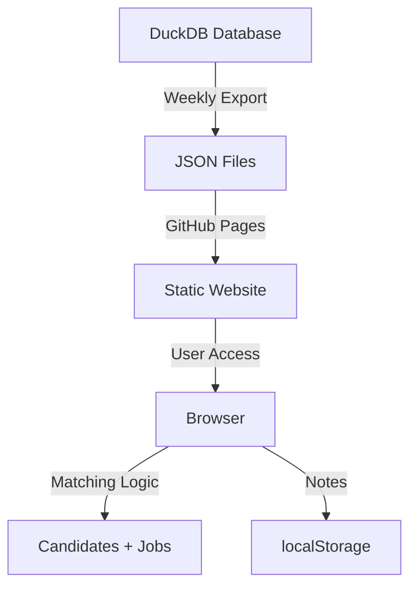

## Welcome to Candidate Matcher

A **static, browser-based candidate matching application** that helps you find the best candidates for your job postings.

::: {.callout-important}
**No Backend Required** - Everything runs in your browser. Data is pre-loaded weekly via automated export from DuckDB.
:::

### Key Features

- ✅ **Multi-select job postings** - Choose multiple jobs to match against
- ✅ **Intelligent matching** - Scores candidates on skills, experience, level, location, and salary
- ✅ **Persistent notes** - Add notes and ratings to candidates (stored in browser)
- ✅ **Export capabilities** - Download results as CSV or JSON
- ✅ **Professional UI** - Clean, corporate design with responsive layout
- ✅ **Weekly data refresh** - Automated updates via GitHub Actions cron

### Quick Links

::: {layout-ncol=2}
- [🚀 Launch App](app.qmd) - Start matching candidates
- [📝 View Notes](notes.qmd) - Review all saved notes
- [📖 Documentation](documentation.qmd) - Full user guide
- [⚙️ Setup Guide](quickstart.qmd) - Get started in 5 minutes
:::

### How It Works

1. **Data Export**: Weekly script exports DuckDB → JSON
2. **GitHub Pages**: Static site auto-deploys
3. **Browser Matching**: Client-side JavaScript scores candidates
4. **Notes Storage**: Saved in browser localStorage
5. **Export**: Download notes anytime as CSV/JSON

### Live Demo

The application is **live and ready to use**:

- **Main App**: https://ezraair555.github.io/candidate-matching/
- **Notes Viewer**: https://ezraair555.github.io/candidate-matching/notes.html
- **GitHub Repo**: https://github.com/ezraair555/candidate-matching

---

## Matching Algorithm

Candidates are scored on **5 weighted dimensions**:

| Dimension | Weight | Description |
|-----------|--------|-------------|
| Skills Match | 40% | Required vs candidate skills overlap |
| Experience Match | 25% | Years and level comparison |
| Level Match | 15% | Entry/Mid/Senior/Executive alignment |
| Location Match | 10% | Remote or same city |
| Salary Match | 10% | Expectation vs budget overlap |

**Overall Score**: 0-100%, color-coded:
- 🟢 **High (80-100%)**: Excellent match
- 🟡 **Medium (60-79%)**: Good potential
- 🔴 **Low (<60%)**: Poor fit

---

## Data Privacy

- ✅ **Private GitHub repo** support
- ✅ **No backend** - no server to hack
- ✅ **Notes stored locally** in your browser
- ✅ **HTTPS by default** via GitHub Pages
- ✅ **No authentication required** (repo permissions handle access)

::: {.callout-warning}
**Note Storage**: Notes are saved per-browser/device using localStorage. They don't sync across devices. Export regularly for backup!
:::

---

## Next Steps

1. **[Launch the App](app.qmd)** - Start matching candidates now
2. **[Setup Guide](quickstart.qmd)** - Deploy your own instance
3. **[Documentation](documentation.qmd)** - Learn all features

Need help? Check the [FAQ](documentation.qmd#faq) or open an issue on [GitHub](https://github.com/ezraair555/candidate-matching/issues).
